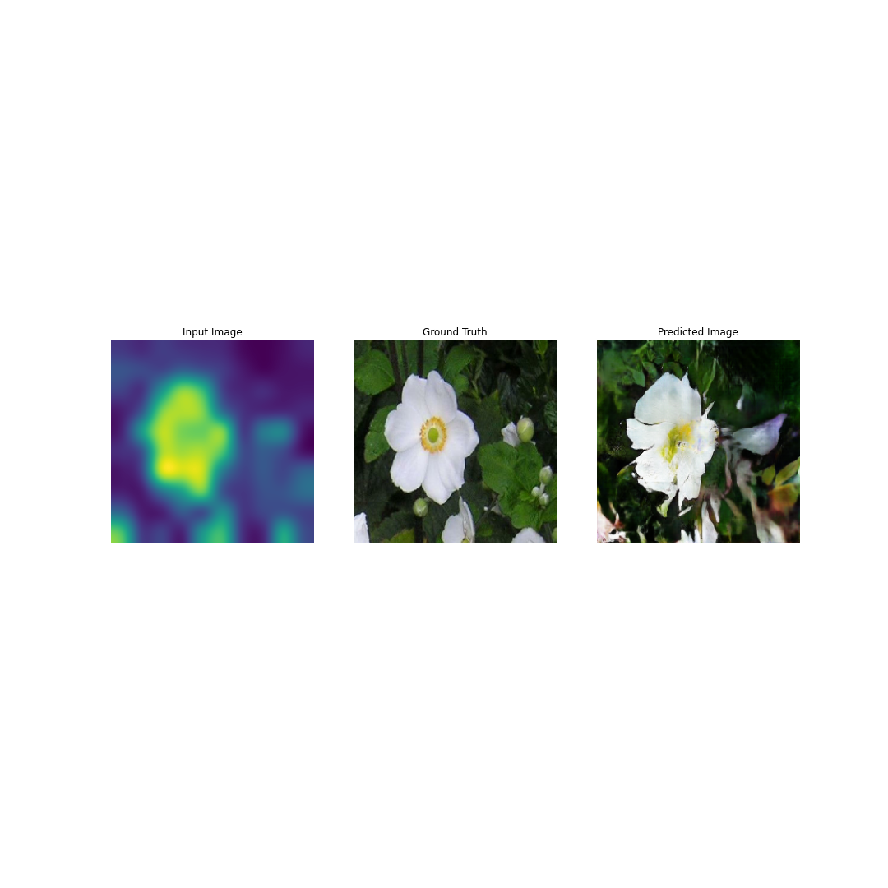

## Auto pix2pix

Packaging up the [Tensorflow implementation][tf-p2p] of the [pix2pix][p2p-paper] model into a pair of classes to help simplify and speed up the process of training and saving models for rapid protoyping. The model has been modified in the style of [Learning to See][lts-paper] by Memo Akten et al. The modification allows for a dataset of single images (rather than pairs) and a preprocessing of the image to a blurry-greyscale version is used to train the model.



A shell script called `frame_extractor.sh` was created to quickly create a dataset from a video. In particular timelapse videos downloaded from YouTube using [youtube-dl][yt-dl] have been pretty good.

---

### Usage:

```
usage: main.py [-h] [-n NAME] [-d DATASET_PATH] [-buf BUFFER_SIZE]
               [-bs BATCH_SIZE] [-e EPOCHS]

A class based implementation of the Tensorflow pix2pix model.

optional arguments:
  -h, --help            show this help message and exit
  -n NAME, --name NAME  Name of the model. All files will be saved in a
                        directory of this name.
  -d DATASET_PATH, --dataset-path DATASET_PATH
                        Path to the dataset file.
  -buf BUFFER_SIZE, --buffer-size BUFFER_SIZE
                        Affects how uniform the shuffling is: if buffer_size
                        is greater than the number of elements in the dataset,
                        you get a uniform shuffle; if it is 1 then you get no
                        shuffling at all. If the dataset is not too large
                        (approx 1000 images) then the total size of the
                        dataset is recommended.
  -bs BATCH_SIZE, --batch-size BATCH_SIZE
                        Batch size to feed into the network when training.
                        Dependant on the amount of memory is at your disposal
                        and the size of the images being used. Defaults to 4.
  -e EPOCHS, --epochs EPOCHS
                        Number of full training cycles. 50 will yield decent
                        enough results with an image size of 256x256 and a
                        dataset of 1000 images.
```

A dataset can be provided to the program via the `--dataset {{directory}}` argument. Given the point of the program is for rapid prototyping, it is advised to only use `.jpg`'s to keep it small and quick. A dataset of approximately 600 - 1000 images works well, any more is unnecessary I think.

Place all images into one folder and the program will automatically sort them into `train` and `test` folders at a ratio of 4:1.

To use the `frame_extractor.sh` script:

```bash
sudo chmod u+x frame_extractor.sh
frame_extractor.sh {{Video}} {{Dataset Directory}} {{Num Images to Extract}} {{Image Scaling}}
```

`{{Image Scaling}}` is an argument passed directly to `ffmpeg`. It is recommended to use `-1:256` which will scale the height to 256 and maintain the aspect ratio. It is then cropped into two images at 256x256: one starting from the top left, and one from the top right. This is a pre-augmentation of the dataset, if you will, getting a bit more data from a single video. More info on `ffmpeg` scaling can be [seen here](https://trac.ffmpeg.org/wiki/Scaling).

A simple usage of the _pix2pix_ model would then be:

```
python3 main.py -d {{Dataset Path}} -n {{Name of Model}} -e {{Epochs}}
```

Again, in the name of rapid prototyping, 50-100 epochs at 256x256 works fine.

An output folder structure like so is created:

```
.
├── {{Name of Model}}
│   ├── checkpoints
│   ├── figures
│   └── models
.
```

An sample output from the generator is saved to `figures` each epoch; `checkpoints` provide the option to resume training if it fails and the `models` are saved as `.h5`'s which are more useful when using the [TensorflowJS-Converter](https://github.com/tensorflow/tfjs-converter).

[A full run through no Google Colab can be seen here.](https://github.com/joshmurr/cci-auto-pix2pix/blob/master/pix2pix_fungus.ipynb)


[tf-p2p]: https://www.tensorflow.org/tutorials/generative/pix2pix
[p2p-paper]: https://arxiv.org/pdf/1611.07004.pdf
[lts-paper]: https://arxiv.org/ftp/arxiv/papers/2003/2003.00902.pdf
[yt-dl]: https://github.com/ytdl-org/youtube-dl/
